# Практическая работа № 2

Дисциплина «Разработка мобильных приложений». Модули, прототип, Firebase Auth, три канала данных и учебный проект MovieProject.

**Студент:** Самсонова Ольга Павловна  
**Группа:** БСБО-09-23  
**Проект:** CloudID, пакет `ru.mirea.samsonova.cloudid`

---

## Содержание

- [Практическая работа № 2](#практическая-работа--2)
  - [Содержание](#содержание)
  - [1. Цель работы](#1-цель-работы)
  - [2. Задание](#2-задание)
  - [3. Прототип экранов](#3-прототип-экранов)
  - [4. Модули domain и data](#4-модули-domain-и-data)
  - [5. Экран авторизации](#5-экран-авторизации)
  - [6. Три канала данных](#6-три-канала-данных)
    - [6.1. SharedPreferences](#61-sharedpreferences)
    - [6.2. Room](#62-room)
    - [6.3. NetworkApi](#63-networkapi)
  - [7. Экраны приложения и модель](#7-экраны-приложения-и-модель)
  - [8. MovieProject](#8-movieproject)
  - [9. Вывод](#9-вывод)

---

## 1. Цель работы

Разделить каркас практики 1 на модули `app`, `domain` и `data`, сделать прототип экранов, вынести вход в отдельную Activity и подключить Firebase Auth. В репозитории оставить три способа хранения: SharedPreferences для клиента, Room для наблюдений и `NetworkApi` с замоканным JSON карточек.

Приложение по-прежнему определяет род облака по снимку неба. Погода не прогнозируется.

Учебный проект MovieProject из практических работ 1 и 2 сохраняет название фильма. Экран, сценарии, репозиторий и SharedPreferences разложены по своим модулям.

## 2. Задание

1. Прототип экранов в Figma или аналоге.
2. Модули `data` (Android-библиотека) и `domain` (Java-библиотека без Android). Код слоёв перенесён из `app`.
3. Отдельная Activity авторизации. Логика Firebase разделена между `app`, `domain` и `data`.
4. В репозитории три канала: SharedPreferences (клиент), Room, класс `NetworkApi` с замоканным JSON.
5. MovieProject: поле названия, сохранение и чтение любимого фильма, use-case, репозиторий, SharedPreferences, отдельные модули domain и data.

Практическая работа № 3 (ViewModel, LiveData, MediatorLiveData) не выполнялась.

| Пункт задания | Где закрыт |
| --- | --- |
| Прототип | раздел 3, `reports/design/cloudid-prototype.html` |
| Модули `domain` и `data` | раздел 4 |
| Auth Activity и Firebase по слоям | раздел 5 |
| SharedPreferences, Room, NetworkApi | раздел 6 |
| MovieProject | раздел 8 |

Семь функциональных требований курса:

| № | Требование | Как сделано |
| --- | --- | --- |
| 1 | Авторизация | `AuthActivity`, Firebase Auth, почта и пароль. Заглушка `google-services.json` лежит в папке `CloudID/app/`. Настоящий файл из Firebase Console ставится в ту же папку. Гость входит без сети |
| 2 | Внешний JSON | `NetworkApi.getCatalogJson()` отдаёт массив карточек. Форма близка к Wikipedia REST summary: название, текст, адрес картинки. HTTP-запрос заданием не требуется |
| 3 | База данных | Room, таблица `sightings`, база `cloudid.db` |
| 4 | Список с изображениями | Каталог 11 родов, картинки по адресам из JSON, Glide |
| 5 | Страница сущности | `DetailsActivity`: фото, название, латинское имя, текст, заметка |
| 6 | Гость и пользователь | Гость видит кадр и каталог. Атлас и сохранение заметки открываются после входа |
| 7 | Готовая модель TFLite | CCSN, файл `ccsn_cloud_classification_model.tflite` в assets модуля `data`, Interpreter на устройстве |

## 3. Прототип экранов

Аналог Figma — интерактивная страница [reports/design/cloudid-prototype.html](design/cloudid-prototype.html). Её можно открыть в браузере. Сверху переключаются экраны. Фон онбординга и кадра — объёмное небо: оно медленно плывёт и при переходе не сменяется. «Дальше» и свайп вверх поднимают белую плашку входа примерно на половину высоты, верхние углы 32 dp. «Создать аккаунт» не открывает другой экран: та же плашка вырастает примерно до 74% высоты, небо над ней остаётся, поля встают на место. При смене вкладки блоки экрана тоже коротко поднимаются.

Стиль: светлое небо, белые карточки, синий акцент `#2F7BFF`, заголовки экранов — Manrope. Над заголовком нет отдельной синей подписи. Латинское имя в карточке — спокойный курсив. Нижняя панель — четыре SVG-иконки без подписей. Картинка внутри плашки скруглена сама, не только рамка плашки.

В каталоге прототипа все 11 родов, список прокручивается. Так же устроен каталог в приложении.

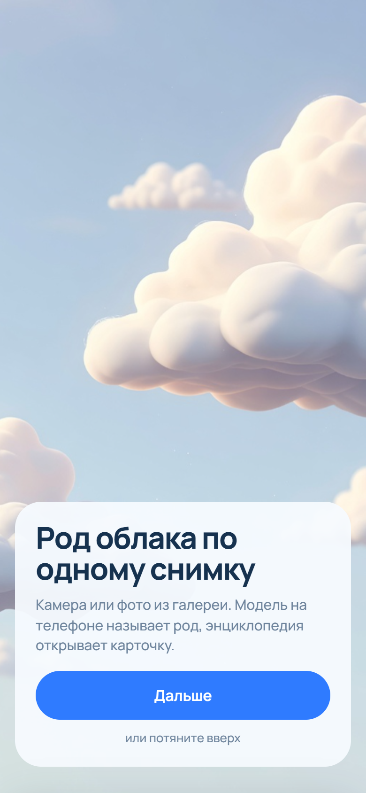

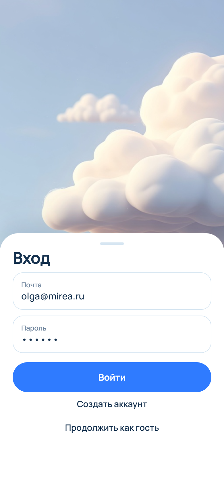

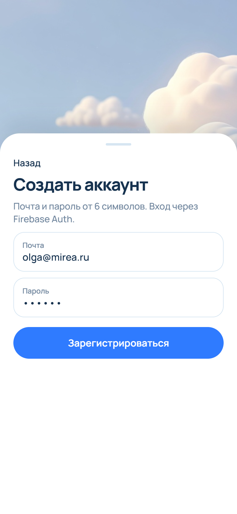

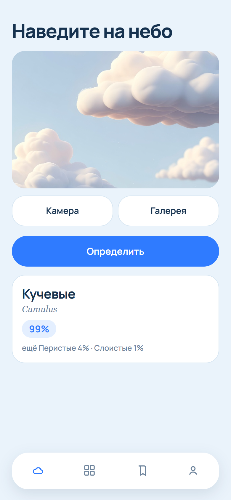

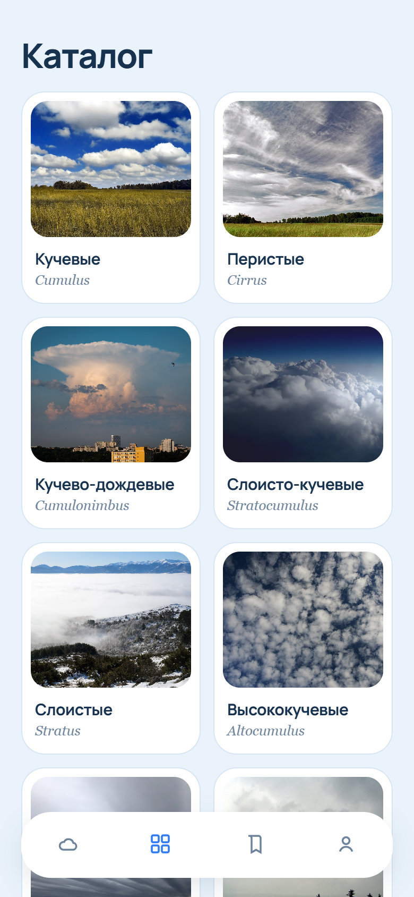

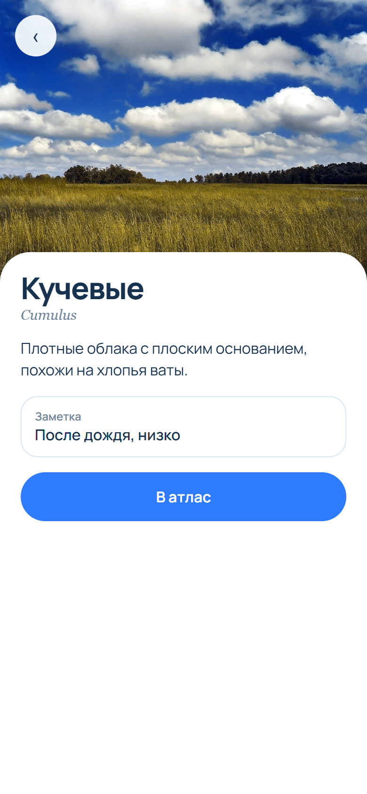

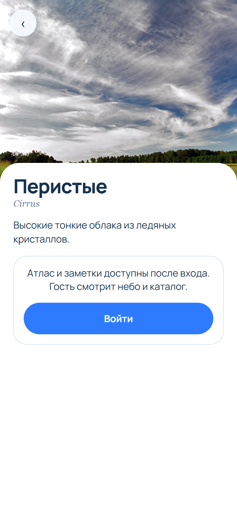

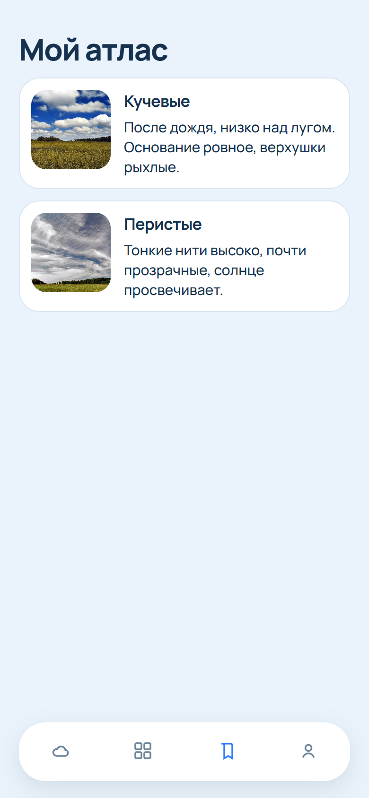

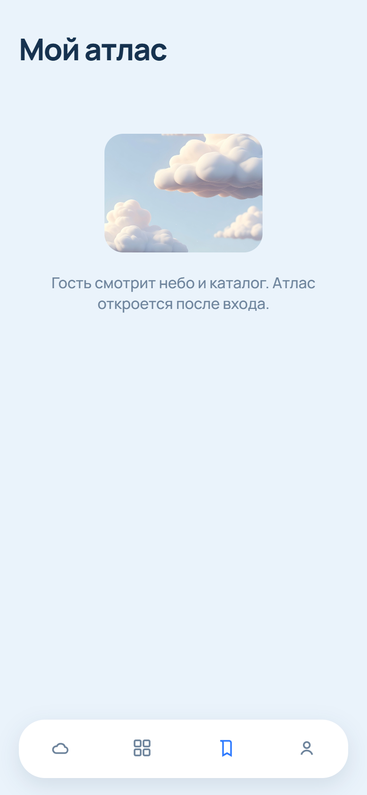

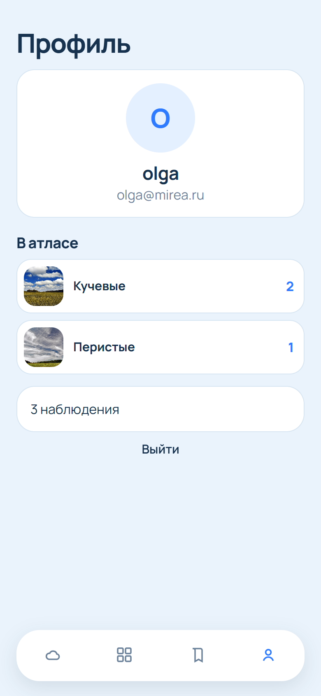

## 4. Модули domain и data

Модули CloudID в `settings.gradle.kts` — `app`, `domain` и `data`. `domain` — Java-библиотека, в зависимостях нет Android. `data` — Android-библиотека и зависит от `domain`. `app` зависит от обоих. Учебные модули фильма подключены рядом и описаны в разделе 8.

В `domain` остались модели `User`, `CloudType`, `Classification`, `Sighting`, интерфейсы репозиториев и use-case. В `User` добавлена дата локального входа: её пишет SharedPreferences, а в domain приходит уже строка.

`LoginUseCase` и `RegisterUseCase` проверяют почту (есть символ `@`) и длину пароля (не короче 6) и вызывают репозиторий через `AuthCallback`. Обратный вызов нужен, потому что Firebase отвечает не сразу. Раньше методы возвращали `boolean` и годились только для тестовой заглушки.

Классификатор принимает `float[]` длиной 224×224×3. Bitmap в domain не импортируется. Пиксели готовит `SkyPixels` в модуле `app`.

## 5. Экран авторизации

Стартовая Activity — `AuthActivity`. Регистрация — вторая страница той же плашки, отдельного экрана нет.

Фон — объёмное изображение неба. `ObjectAnimator` сдвигает его по X и Y туда и обратно, масштаб около 1.12, края кадра не просвечивают. По нажатию «Дальше», свайпу вверх по небу или жесту за ручку плашка высотой 52% экрана выезжает снизу. Карточка знакомства при этом гаснет. «Создать аккаунт» увеличивает высоту до 74% и сменяет поля с короткой анимацией. «Назад» возвращает вход. Верхние углы остаются скруглёнными: плашка обрезается по фону, а при клавиатуре над ней остаётся полоска неба.

Цепочка входа:

1. `AuthActivity` вызывает `LoginUseCase`.
2. Use-case вызывает `AuthRepository.login`.
3. `AuthRepositoryImpl` в модуле `data` вызывает `FirebaseAuthDataSource`.
4. После успеха репозиторий пишет `ClientRecord` в SharedPreferences и переводит его в `User`.

**Листинг 1.** Контракт авторизации в domain

```java
public interface AuthRepository {
    void login(String email, String password, AuthCallback callback);
    void register(String email, String password, AuthCallback callback);
    void continueAsGuest();
    User getProfile();
    void logout();
}
```

**Листинг 2.** Запись клиента становится моделью domain

```java
private User mapToDomain(ClientRecord record) {
    return new User(record.getId(), record.getEmail(), record.isGuest(), record.getLocalDate());
}
```

`ClientRecord` живёт только в `data`. Domain этот класс не видит.

`CloudID/app/google-services.json` — заглушка проекта `cloudid-mirea`, пакет `ru.mirea.samsonova.cloudid`. Настоящий файл из Firebase Console кладётся в папку `CloudID/app/` вместо этой заглушки. Гостевой вход к Firebase по сети не обращается.

Если пользователь уже вошёл, следующий запуск сразу открывает `HomeActivity`.

## 6. Три канала данных

### 6.1. SharedPreferences

`SharedPrefClientStorage` хранит файл `cloudid_client`: id, почта, признак гостя, дата. При первом запуске записи нет, метод `get()` возвращает гостя. После входа репозиторий сохраняет почту и сегодняшнюю дату. Выход снова записывает гостя и вызывает `FirebaseAuth.signOut()`.

### 6.2. Room

Таблица `sightings`: id, код рода, название, заметка, дата, путь к фото. `AtlasRepositoryImpl` переводит `SightingEntity` в `Sighting` и обратно. Схема пустая, пока пользователь сам не сохранит кадр. Запросы идут с главного потока (`allowMainThreadQueries`): для учебного атласа этого достаточно.

`SaveSightingUseCase` не пишет строку, если профиль гостевой.

**Листинг 3.** Гость не попадает в базу

```java
public boolean execute(Sighting sighting) {
    User user = authRepository.getProfile();
    if (user.isGuest()) {
        return false;
    }
    return atlasRepository.save(sighting);
}
```

`GetMyAtlasUseCase` для гостя возвращает пустой список, даже если в базе что-то осталось от прошлой сессии.

### 6.3. NetworkApi

`NetworkApi.getCatalogJson()` собирает JSON-массив из 11 элементов: `code`, `name`, `latin`, `image`, `extract`. В поле `image` — адрес кадра из `app/src/main/assets/clouds`. Это те же фотографии Wikimedia, что в прототипе, сторона до 1400 px, а не превью 330 px. `CloudRepositoryImpl` разбирает массив в `CloudType`, Glide кладёт кадр в скруглённую картинку карточки. Позже тело метода можно заменить на HTTP `GET https://en.wikipedia.org/api/rest_v1/page/summary/...` с заголовком User-Agent.

## 7. Экраны приложения и модель

`HomeActivity` держит четыре фрагмента и нижнюю панель из `ImageButton`. Выбранная иконка красится в акцент через `ColorStateList`.

| Экран | Поведение |
| --- | --- |
| Небо | Камера (`TakePicturePreview`), галерея, пробный кадр — объёмное небо. «Определить» считает тензор в фоне |
| Каталог | Сетка из двух колонок, все 11 родов. У фото свой радиус внутри плашки |
| Карточка | Фото, текст, поле заметки, «В атлас» |
| Атлас | Список наблюдений: название и текст заметки, без даты. У гостя — пустое состояние |
| Профиль | Буква, имя из почты, сколько кадров каждого рода сохранено в атлас, «Выйти». Дата входа по-прежнему пишется в SharedPreferences и в интерфейсе не показывается |

На карточке гостя поля заметки нет. Вместо него карточка: атлас откроется после входа. Кнопка «Войти» возвращает на экран неба.

Модель CCSN лежит в `data/src/main/assets` и входит в пакет приложения без сжатия, иначе `Interpreter` не отображает файл в память. Вход: 1×224×224×3, float32, делитель 255, порядок NHWC. Выход: 11 чисел, на экран попадают три лучших.

Порядок классов — алфавит папок CCSN, не список из `miniclass.py`:

```text
Ac, As, Cb, Cc, Ci, Cs, Ct, Cu, Ns, Sc, St
```

Это высококучевые, высокослоистые, кучево-дождевые, перисто-кучевые, перистые, перисто-слоистые, инверсионный след, кучевые, слоисто-дождевые, слоисто-кучевые, слоистые.

Если буфер пикселей битый, репозиторий возвращает кучевые с оценкой 0.99, чтобы экран не падал. На учебном снимке с земли кучевые и перистые отделяются уверенно. Кучевые и кучево-дождевые модель путает чаще, вид сверху тоже слабее: так устроен датасет CCSN. Результат приложения — род и карточка, без прогноза погоды.

## 8. MovieProject

Учебное приложение из практических работ 1 и 2 собрано отдельными модулями в том же проекте Android Studio. Модуль `MovieProject`, пакет `ru.mirea.samsonova.lesson9`. Слой domain — Java-библиотека `movie-domain`, без Android в зависимостях. Слой data — Android-библиотека `movie-data`, она зависит только от `movie-domain`. Приложение зависит от обоих модулей. Зависимости CloudID остались прежними: `app` зависит от `domain` и `data`.

Экран один, `MainActivity`. Сверху подпись, затем кнопка «Сохранить любимый фильм», поле с подсказкой «Заполни меня» и кнопка «Отобразить любимый фильм».

**Листинг 4.** Модель и контракт репозитория в domain

```java
public class Movie {
    private final int id;
    private final String name;

    public Movie(int id, String name) {
        this.id = id;
        this.name = name;
    }

    public int getId() {
        return id;
    }

    public String getName() {
        return name;
    }
}

public interface MovieRepository {
    boolean saveMovie(Movie movie);

    Movie getMovie();
}
```

**Листинг 5.** Сценарии сохранения и чтения

```java
public boolean execute(Movie movie) {
    if (movie.getName() == null || movie.getName().trim().isEmpty()) {
        return false;
    }
    return movieRepository.saveMovie(movie);
}

public Movie execute() {
    return movieRepository.getMovie();
}
```

Пустое название не записывается. `SaveMovieToFavoriteUseCase` вызывает `saveMovie`, `GetFavoriteFilmUseCase` вызывает `getMovie`.

В data своя модель фильма: `id`, `name` и `localDate`. Интерфейс хранилища принимает и отдаёт именно её. Domain эту модель не видит.

**Листинг 6.** Хранилище SharedPreferences

```java
public interface MovieStorage {
    Movie get();

    boolean save(Movie movie);
}

private static final String SHARED_PREFS_NAME = "shared_prefs_name";
private static final String KEY = "movie_name";
private static final String DATE_KEY = "movie_date";
private static final String ID_KEY = "movie_id";

public Movie get() {
    String movieName = sharedPreferences.getString(KEY, "unknown");
    String movieDate = sharedPreferences.getString(DATE_KEY, LocalDate.now().toString());
    int movieId = sharedPreferences.getInt(ID_KEY, -1);
    return new Movie(movieId, movieName, movieDate);
}

public boolean save(Movie movie) {
    sharedPreferences.edit()
            .putString(KEY, movie.getName())
            .putString(DATE_KEY, movie.getLocalDate())
            .putInt(ID_KEY, movie.getId())
            .commit();
    return true;
}
```

`Context` нужен только конструктору `SharedPrefMovieStorage`: из него берётся `SharedPreferences`, сам контекст не хранится и в domain не передаётся. Если записи ещё нет, имя — `unknown`, дата — сегодняшний день, идентификатор — `-1`.

`MovieRepositoryImpl` переводит модели. В хранилище уходит идентификатор и имя из domain, дата ставится при преобразовании. Обратно в domain уходят только идентификатор и имя, дата в domain не попадает.

**Листинг 7.** Преобразование моделей

```java
private Movie mapToStorage(ru.mirea.samsonova.lesson9.domain.models.Movie movie) {
    return new Movie(movie.getId(), movie.getName(), LocalDate.now().toString());
}

private ru.mirea.samsonova.lesson9.domain.models.Movie mapToDomain(Movie movie) {
    return new ru.mirea.samsonova.lesson9.domain.models.Movie(movie.getId(), movie.getName());
}
```

Кнопка сохранения собирает `Movie(2, текст поля)` и передаёт его в `SaveMovieToFavoriteUseCase`. Подпись становится `Save result` и значением `boolean`. Кнопка чтения вызывает `GetFavoriteFilmUseCase` и пишет в ту же подпись `Save result` и имя фильма.

**Листинг 8.** Кнопки экрана

```java
findViewById(R.id.buttonSaveMovie).setOnClickListener(view -> {
    boolean result = new SaveMovieToFavoriteUseCase(movieRepository)
            .execute(new Movie(2, text.getText().toString()));
    textView.setText(String.format("Save result %s", result));
});
findViewById(R.id.buttonGetMovie).setOnClickListener(view -> {
    Movie movie = new GetFavoriteFilmUseCase(movieRepository).execute();
    textView.setText(String.format("Save result %s", movie.getName()));
});
```

В поле введено Interstellar. После сохранения подпись — `Save result true`. После чтения — `Save result Interstellar`, имя взято из SharedPreferences.

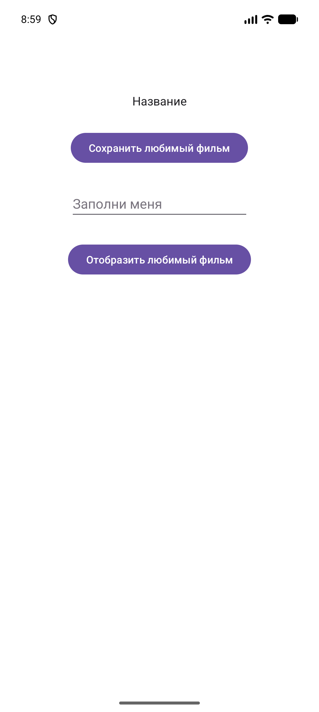

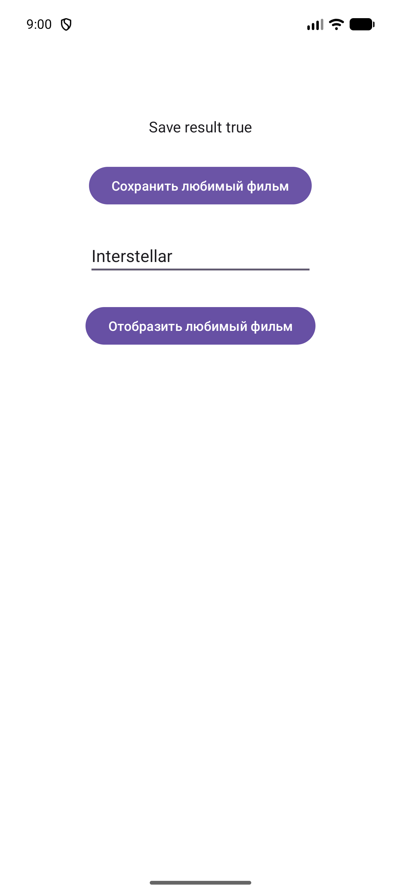


## 9. Вывод

Проект CloudID разложен на `app`, `domain` и `data`. Прототип — объёмное небо, плашка входа и регистрация на этой же плашке, остальные экраны атласа (рисунки 1–10). Авторизация разведена по слоям: Activity, use-case, Firebase и SharedPreferences. Наблюдения пишет Room, карточки родов приходят из замоканного JSON. В профиле виден состав атласа по родам. Гость не сохраняет кадр. Модель CCSN подключена на устройстве.

MovieProject сохраняет название фильма и читает его обратно (рисунки 11–13). Domain фильма не зависит от Android. Дата записи остаётся в слое data.
