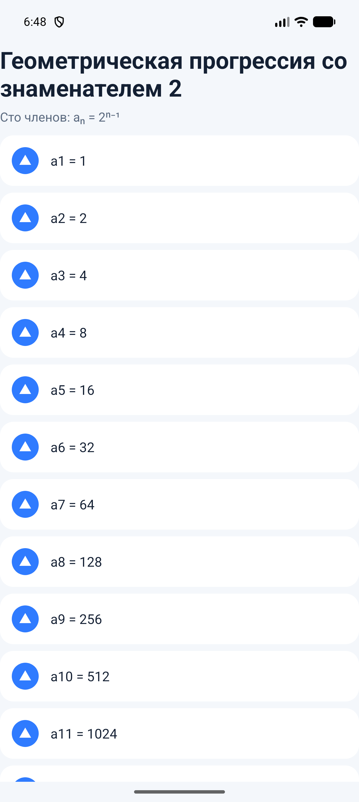
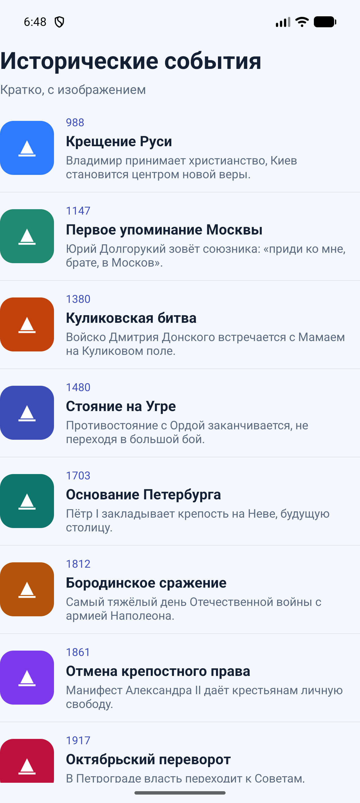
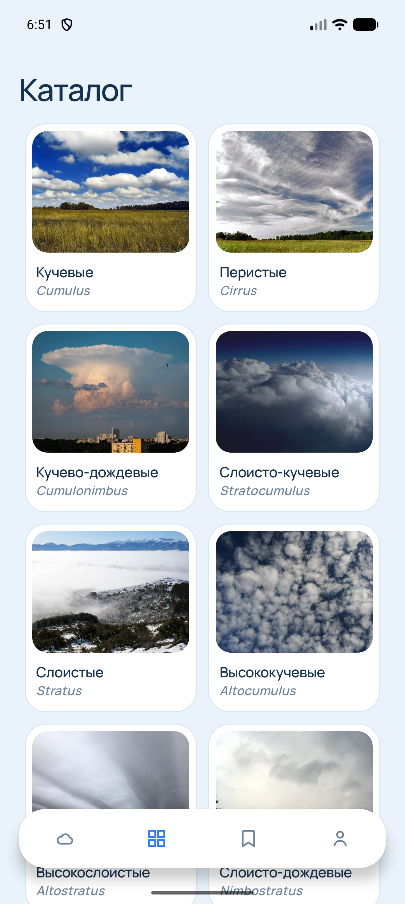

# Практическая работа № 4

Дисциплина «Разработка мобильных приложений». Списки: ScrollView, ListView и RecyclerView.

**Студент:** Самсонова Ольга Павловна  
**Группа:** БСБО-09-23  
**Проект:** CloudID, пакет `ru.mirea.samsonova.cloudid`

---

## Содержание

1. [Цель работы](#1-цель-работы)
2. [Задание](#2-задание)
3. [ScrollView](#3-scrollview)
4. [ListView](#4-listview)
5. [RecyclerView](#5-recyclerview)
6. [Каталог CloudID](#6-каталог-cloudid)
7. [Вывод](#7-вывод)

---

## 1. Цель работы

Собрать три способа показа длинного списка и подключить каталог родов CloudID к `RecyclerView`. Данные заглушки лежат в репозитории, во ViewModel приходят как `LiveData`, адаптер получает их методом `setItems`.

## 2. Задание

1. Модуль `ScrollViewApp`: геометрическая прогрессия со знаменателем 2, сто членов.
2. Модуль `ListViewApp`: список авторов и книг, которые планируется прочитать, больше тридцати позиций.
3. Модуль со списком исторических событий: краткое описание и изображение. В указаниях для этого пункта повторяется имя `ListViewApp`, поэтому модуль назван `RecyclerViewApp`.
4. В приложении из практической работы № 1 заглушка набора данных передаётся в слой представления через `LiveData` и устанавливается в `RecyclerView`.

| Пункт | Где сделано |
| --- | --- |
| ScrollView, 100 членов | модуль `ScrollViewApp` |
| ListView, 36 книг | модуль `ListViewApp` |
| RecyclerView, события | модуль `RecyclerViewApp` |
| Заглушка, LiveData, RecyclerView | `NetworkApi`, `HomeViewModel`, `CloudCardAdapter` |

## 3. ScrollView

`ScrollView` держит один дочерний `LinearLayout`. Сто строк собираются в цикле: `LayoutInflater` читает `item.xml`, в текст пишется член прогрессии, строка добавляется в контейнер. Первый член равен 1, каждый следующий в два раза больше. Сотый член — это 2⁹⁹, обычного `long` не хватает, поэтому значение считается через `BigInteger`.

**Листинг 1.** Сто членов прогрессии

```java
for (int index = 0; index < TERMS; index++) {
    View row = inflater.inflate(R.layout.item, wrapper, false);
    TextView text = row.findViewById(R.id.textValue);
    BigInteger value = BigInteger.ONE.shiftLeft(index);
    text.setText("a" + (index + 1) + " = " + value.toString());
    wrapper.addView(row);
}
```



## 4. ListView

Список на тридцать лет — 36 книг. У строки два поля: название и автор. `BookAdapter` наследует `BaseAdapter`. Если `convertView` уже есть, новая разметка не создаётся.

**Листинг 2.** Строка ListView

```java
public View getView(int position, View convertView, ViewGroup parent) {
    View row = convertView;
    if (row == null) {
        row = inflater.inflate(R.layout.item_book, parent, false);
    }
    Book book = getItem(position);
    title.setText(book.title);
    author.setText(book.author);
    return row;
}
```


## 5. RecyclerView

Событие хранит год, название, короткое описание и цвет метки. `EventViewHolder` один раз находит `ImageView` и три `TextView`. `EventAdapter.setItems` заменяет список и вызывает `notifyDataSetChanged`. У списка `LinearLayoutManager` и `DividerItemDecoration`. Нажатие показывает год и название.

Изображение строки — метка в `ImageView`: общий знак и свой цвет у каждого события.

**Листинг 3.** Привязка события

```java
public void bind(Event event) {
    year.setText(event.year);
    title.setText(event.title);
    description.setText(event.description);
    image.setBackgroundTintList(ColorStateList.valueOf(event.color));
}
```



## 6. Каталог CloudID

Заглушка внешнего сервиса — `NetworkApi.getCatalogJson()`. Форма та же, что позже придёт от Wikipedia REST summary: название, текст, адрес картинки. `CloudRepositoryImpl` разбирает массив в `CloudType`. `HomeViewModel` публикует каталог внутри `LiveData`. Фрагмент создаёт адаптер один раз и подписывается на это значение.

**Листинг 4.** LiveData попадает в RecyclerView

```java
CloudCardAdapter adapter = new CloudCardAdapter(this::open);
recycler.setAdapter(adapter);
viewModel.library().observe(getViewLifecycleOwner(), library -> {
    if (library == null) {
        return;
    }
    adapter.setItems(library.catalog);
});
```

`setItems` очищает прежний список, копирует новый и вызывает `notifyDataSetChanged`. Сетка из двух колонок, у карточки фото, русское имя и латинское. Нажатие открывает `DetailsActivity`. Атлас устроен так же: один `SightingRowAdapter`, данные приходят из той же `LiveData`.



## 7. Вывод

Сто членов прогрессии показаны через `ScrollView`, тридцать шесть книг — через `ListView`, исторические события — через `RecyclerView` с `ViewHolder`. Каталог CloudID берёт заглушку из репозитория, проводит её через `LiveData` и рисует в `RecyclerView` без пересоздания адаптера.
