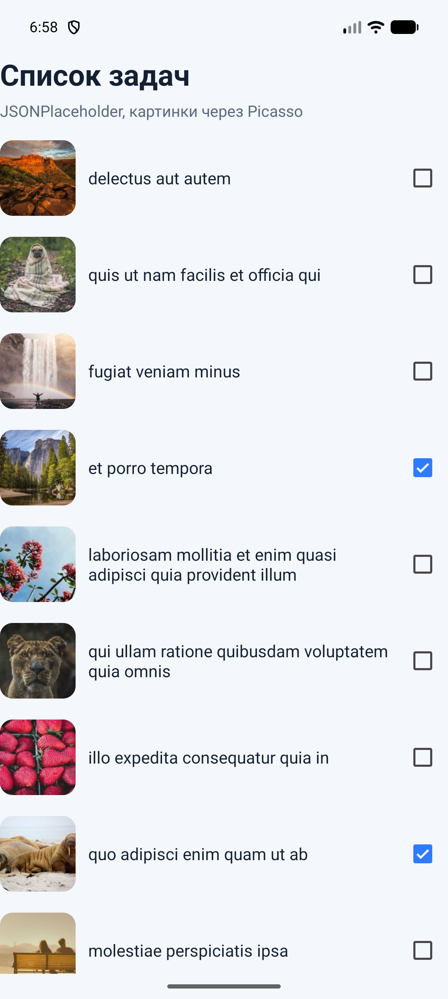
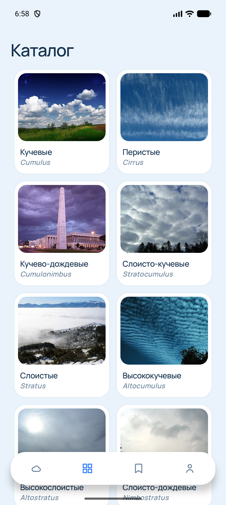
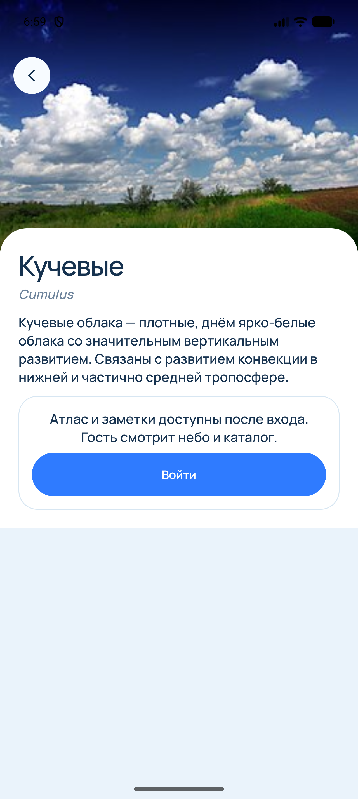

# Практическая работа № 5

Дисциплина «Разработка мобильных приложений». Retrofit и загрузка изображений.

**Студент:** Самсонова Ольга Павловна  
**Группа:** БСБО-09-23  
**Проект:** CloudID, пакет `ru.mirea.samsonova.cloudid`

---

## Содержание

1. [Цель работы](#1-цель-работы)
2. [Задание](#2-задание)
3. [Список задач](#3-список-задач)
4. [Каталог CloudID из Wikipedia](#4-каталог-cloudid-из-wikipedia)
5. [Вывод](#5-вывод)

---

## 1. Цель работы

Получить список сущностей по сети через Retrofit, обработать ошибку ответа и показать картинки. Учебный список задач берёт JSONPlaceholder и Picasso. Каталог родов CloudID берёт краткие статьи Русской Википедии, картинку в карточку кладёт Glide.

## 2. Задание

1. Запросить список задач, показать его в `RecyclerView`. При смене флажка отправить запрос на обновление записи.
2. Добавить в строку изображение и загрузить несколько картинок из интернета через Picasso: размер, обрезка, картинка на время загрузки и картинка при ошибке.
3. В приложении из практической работы № 1 получить сущности из сети через Retrofit, обработать ошибки и показать изображения.

| Пункт | Где сделано |
| --- | --- |
| Список и обновление флажка | модуль `RetrofitApp`, `PUT todos/{id}` |
| Picasso | `TodoAdapter` |
| Каталог CloudID | `WikiApi`, `CloudRepositoryImpl`, Glide |

## 3. Список задач

Базовый адрес — `https://jsonplaceholder.typicode.com/`. `ApiService` описывает два вызова: `GET todos` и `PUT todos/{id}`. Ответ разбирает Gson. Список рисует `RecyclerView`.

У строки три части: фото, название, флажок. Адрес фото собирается из номера задачи, чтобы одни и те же десять кадров повторялись. Picasso уменьшает кадр до 160×160, обрезает по центру, пока файл не пришёл показывает серую плашку, при сбое — розовую.

**Листинг 1.** Загрузка картинки

```java
Picasso.get()
        .load(todo.imageUrl())
        .resize(160, 160)
        .centerCrop()
        .placeholder(R.drawable.ph_photo)
        .error(R.drawable.err_photo)
        .into(holder.image);
```

Смена флажка сразу пишет новое значение в модель и вызывает `updateTodo`. Если код ответа неуспешный или запрос оборвался, флажок возвращается назад и на экране остаётся прежнее состояние. Ошибка первого списка пишется над ним: пустой ответ и код HTTP — это не то же самое, что обрыв сети.



## 4. Каталог CloudID из Wikipedia

Карточки родов читаются из `https://ru.wikipedia.org/api/rest_v1/page/summary/{title}`. Заголовок запроса — `User-Agent` приложения. Для каждого кода рода свой заголовок статьи: кучевые, перистые, кучево-дождевые и остальные восемь, включая инверсионный след.

`GetCloudCatalogUseCase` по-прежнему единственная точка входа из ViewModel. Репозиторий сначала берёт сохранённый JSON, затем для каждой строки вызывает Retrofit. Из ответа берётся текст `extract` и, если он есть, адрес `thumbnail`. Русское имя и латинское имя остаются из сохранённого каталога. Если у статьи нет картинки, остаётся локальный кадр. Если запрос не удался, строка целиком остаётся из сохранённого каталога.

Ошибка не роняет экран. `CatalogLoad` несёт список и короткую фразу. Фраза пустая, когда пришли все одиннадцать статей. Если сеть молчит, каталог всё равно открывается, а над сеткой написано, что показан сохранённый набор. Если пришла только часть статей, над сеткой написано, что остальные карточки взяты из сохранённого каталога.

Картинка по адресу из сети попадает в ту же сетку. Её рисует Glide. Picasso остаётся в модуле задач.

**Листинг 2.** Ответ Wikipedia становится карточкой

```java
Response<WikiSummary> response = wikiApi.summary(title).execute();
if (!response.isSuccessful() || response.body() == null) {
    return null;
}
String extract = summary.extract == null || summary.extract.trim().isEmpty()
        ? stub.getExtract()
        : summary.extract.trim();
String image = stub.getImageUrl();
if (summary.thumbnail != null && summary.thumbnail.source != null
        && !summary.thumbnail.source.isEmpty()) {
    image = summary.thumbnail.source;
}
return new CloudType(stub.getCode(), stub.getName(), stub.getLatin(), image, extract);
```

Запрос каталога идёт в фоне из `HomeViewModel`. Карточка рода после этого читает уже собранный список и не зовёт сеть ещё раз.





## 5. Вывод

Список задач приходит через Retrofit, флажок уходит обратно запросом `PUT`, фото строк загружает Picasso. Каталог CloudID получает одиннадцать статей Русской Википедии тем же способом. Сбой сети оставляет сохранённые карточки и пишет об этом над списком. Картинки каталога по-прежнему показывает Glide.
