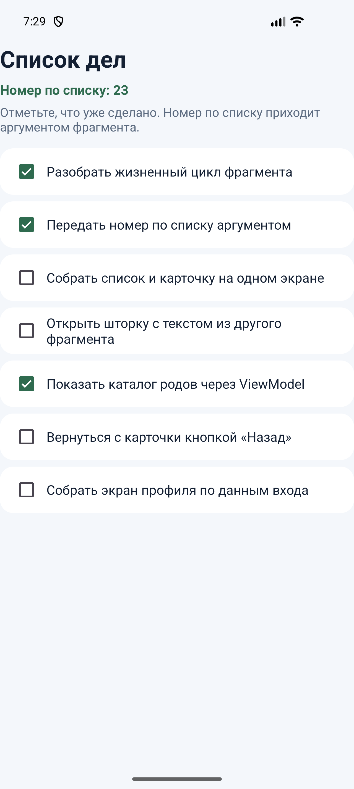
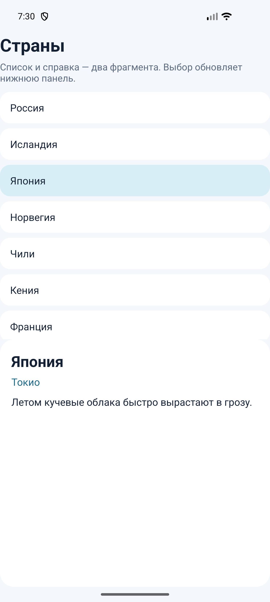
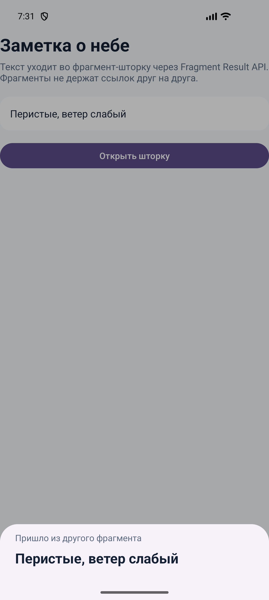
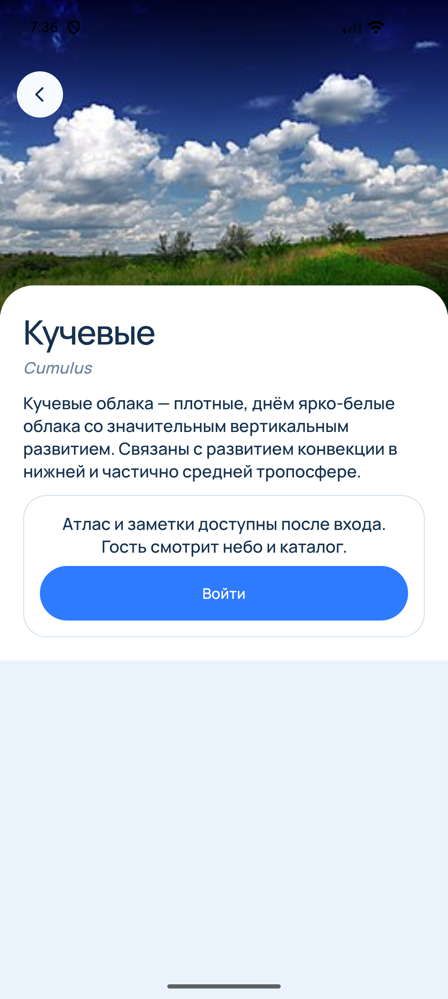
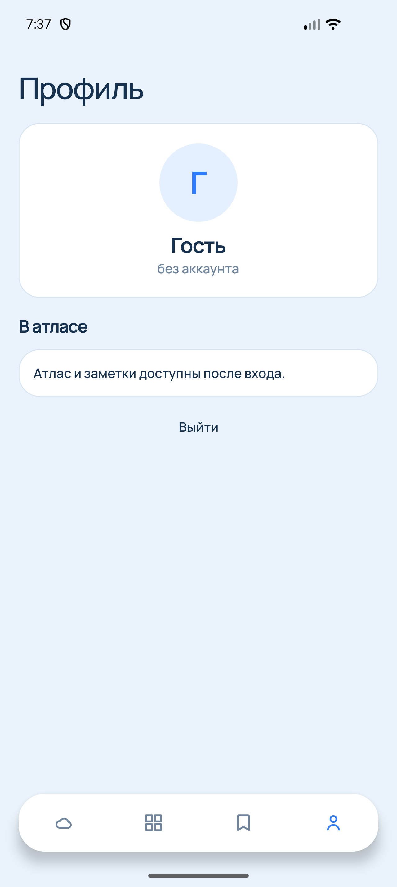

# Практическая работа № 6

Дисциплина «Разработка мобильных приложений». Фрагменты, обмен данными и бэк-стек.

**Студент:** Самсонова Ольга Павловна  
**Группа:** БСБО-09-23  
**Проект:** CloudID, пакет `ru.mirea.samsonova.cloudid`

---

## Содержание

1. [Цель работы](#1-цель-работы)
2. [Задание](#2-задание)
3. [Список дел](#3-список-дел)
4. [Список и справка](#4-список-и-справка)
5. [Передача результата](#5-передача-результата)
6. [Экраны CloudID](#6-экраны-cloudid)
7. [Вывод](#7-вывод)

---

## 1. Цель работы

Собрать экран из фрагментов, передать во фрагмент аргументы и результат другого фрагмента, связать список и справку общей ViewModel. В CloudID каталог, профиль и карточка рода остаются фрагментами, карточка кладётся в бэк-стек.

## 2. Задание

1. Модуль `FragmentApp`: список дел и статус выполнения. Номер по списку передаётся фрагменту через `Bundle`. В разметке активности у контейнера нет атрибута `android:name`.
2. Модуль `FragmentManagerApp`: несколько фрагментов. Первый держит список, второй — справку по выбранному пункту. На главном экране фрагменты объявлены тегом `fragment` с `android:name`. Выбор пункта обновляет справку.
3. Модуль `ResultApiFragmentApp`: текст из одного фрагмента попадает в другой через Fragment Result API. Приёмник — нижняя шторка.
4. В приложении из практической работы № 1 список сущностей показывается через ViewModel и фрагменты. Экран «Профиль» строится по данным входа. Переходы между экранами идут через фрагменты, у карточки есть бэк-стек.

| Пункт | Где сделано |
| --- | --- |
| Список дел и номер по списку | `FragmentApp` |
| Список и справка | `FragmentManagerApp`, общая `ShareViewModel` |
| Результат между фрагментами | `ResultApiFragmentApp` |
| Каталог, профиль, бэк-стек карточки | `HomeActivity`, `DetailsFragment`, `ProfileFragment` |

## 3. Список дел

`MainActivity` добавляет `TasksFragment` один раз, только когда `savedInstanceState` равен `null`. Иначе фрагмент восстановится сам. Аргумент кладётся в транзакцию, а не в разметку.

**Листинг 1.** Номер по списку уходит аргументом

```java
Bundle bundle = new Bundle();
bundle.putInt("my_number_student", STUDENT_NUMBER);
getSupportFragmentManager().beginTransaction()
        .setReorderingAllowed(true)
        .add(R.id.fragmentContainer, TasksFragment.class, bundle)
        .commit();
```

Фрагмент читает число в `onViewCreated` через `requireArguments()` и пишет его над списком. У каждой строки свой флажок: часть дел уже отмечена, остальные переключаются нажатием.



## 4. Список и справка

На главном экране два статических фрагмента: список стран и справка. Они не знают друг о друге. Оба берут одну `ShareViewModel` с областью видимости активности.

**Листинг 2.** Выбор страны пишет значение, справка его читает

```java
ShareViewModel viewModel = new ViewModelProvider(requireActivity()).get(ShareViewModel.class);
viewModel.selected().observe(getViewLifecycleOwner(), country -> {
    if (country == null) {
        return;
    }
    name.setText(country.name);
    capital.setText(country.capital);
    fact.setText(country.fact);
});
```

При открытии экрана выбрана первая страна, поэтому справка не пустая. Нажатие на другую строку меняет и подсветку списка, и текст внизу.



## 5. Передача результата

`DataFragment` забирает строку из поля и кладёт её в `Bundle` под ключом `requestKey`. Шторка `BottomSheetFragment` слушает тот же ключ у своего `parentFragmentManager`. Это дочерний `FragmentManager` экрана с полем, поэтому фрагменты не держат ссылок друг на друга. Если слушатель ещё не зарегистрирован, результат хранится, пока шторка не откроется.

**Листинг 3.** Результат уходит до показа шторки

```java
bundle.putString("key", text);
getChildFragmentManager().setFragmentResult("requestKey", bundle);
BottomSheetFragment sheet = new BottomSheetFragment();
sheet.show(getChildFragmentManager(), "ModalBottomSheet");
```

Шторка показывает полученную строку. Пустое поле даёт короткую фразу «Текст не введён».



## 6. Экраны CloudID

Каталог по-прежнему фрагмент. Список родов приходит из `HomeViewModel`: сеть и сохранённый каталог собираются в фоне, на экран попадает готовый набор. Атлас и небо тоже фрагменты той же активности. Нижняя панель из четырёх значков показывает и прячет их через `FragmentTransaction`, не создавая фрагмент заново при каждом переключении.

Профиль — отдельный фрагмент. Буква, имя и подпись берутся из данных входа. У гостя буква «Г», подпись «без аккаунта», счётчиков родов нет, вместо них фраза «Атлас и заметки доступны после входа.»

Карточка рода больше не открывается отдельной активностью. `DetailsFragment` получает код рода и адрес снимка аргументами и добавляется поверх текущего раздела с `addToBackStack`. Нижняя панель на время карточки скрыта. Кнопка «Назад» на карточке и системная кнопка «Назад» снимают запись со стека и возвращают предыдущий раздел.

**Листинг 4.** Карточка попадает в бэк-стек

```java
getSupportFragmentManager().beginTransaction()
        .setReorderingAllowed(true)
        .add(R.id.fragmentContainer, DetailsFragment.newInstance(code, photo))
        .addToBackStack("details")
        .commit();
```

Гость по-прежнему видит текст статьи и не видит поле заметки. Кнопка «Войти» на карточке ведёт на экран входа.





## 7. Вывод

Список дел живёт во фрагменте и получает номер по списку аргументом. Список стран и справка делят одну ViewModel, выбор строки сразу меняет нижний фрагмент. Текст заметки уходит в шторку через Fragment Result API. В CloudID каталог, профиль и карточка рода — фрагменты одной активности. Карточка лежит в бэк-стеке: «Назад» возвращает к списку, с которого она была открыта.
