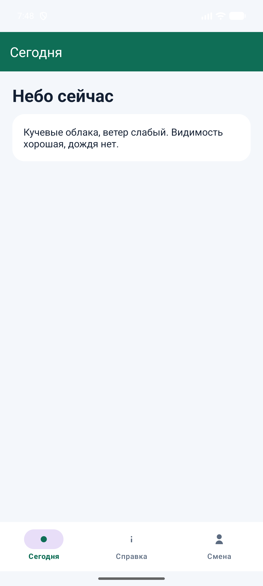
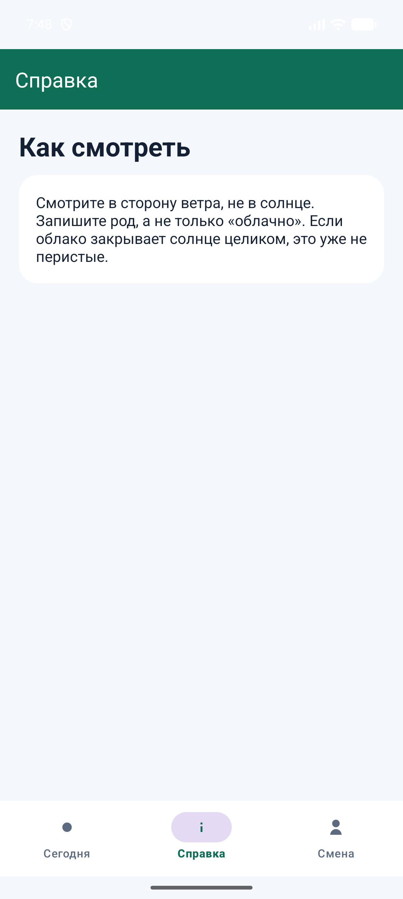
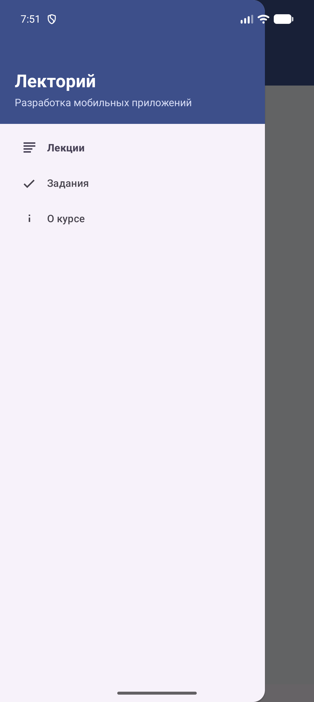
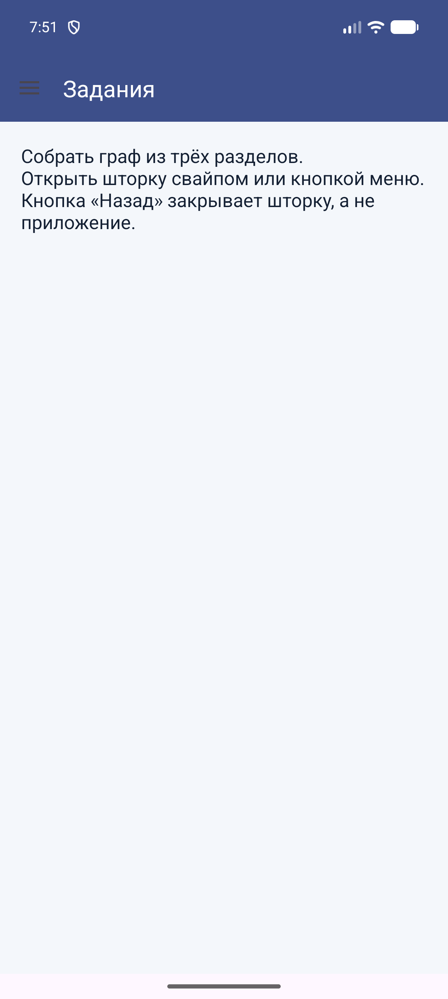
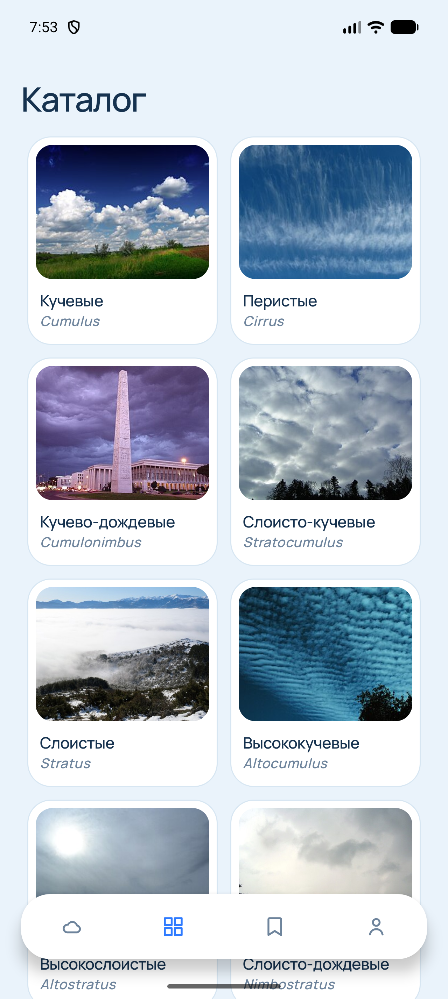
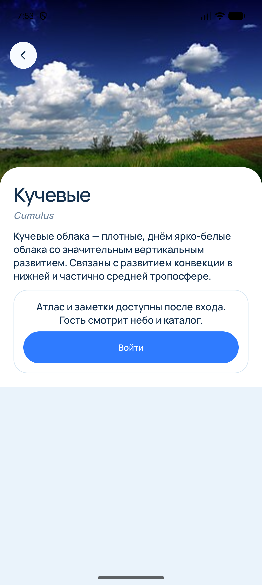

# Практическая работа № 7

Дисциплина «Разработка мобильных приложений». Navigation Component, нижнее меню и боковая шторка.

**Студент:** Самсонова Ольга Павловна  
**Группа:** БСБО-09-23  
**Проект:** CloudID, пакет `ru.mirea.samsonova.cloudid`

---

## Содержание

1. [Цель работы](#1-цель-работы)
2. [Задание](#2-задание)
3. [Нижнее меню](#3-нижнее-меню)
4. [Боковая шторка](#4-боковая-шторка)
5. [Навигация CloudID](#5-навигация-cloudid)
6. [Вывод](#6-вывод)

---

## 1. Цель работы

Связать экраны одним графом навигации. Отдельно показать нижнее меню и боковую шторку. В CloudID четыре раздела и карточка рода открываются через `NavController`.

## 2. Задание

Библиотека Navigation Component взята версии 2.8.4. В двух учебных модулях включён View Binding: активность и фрагменты получают разметку через сгенерированный класс, в `onDestroyView` ссылка на binding обнуляется. CloudID по-прежнему находит виджеты через `findViewById`.

1. Модуль `BottomNavigationApp`. Свой сюжет, свои иконки и цвета. Пункты нижнего меню совпадают с пунктами графа.
2. Модуль `NavigationDrawerApp`. Свой сюжет и цвета. Шторка связана с панелью действий через `setOpenableLayout`. Системная «Назад» закрывает открытую шторку и оставляет приложение.
3. В приложении из практической работы № 1 переходы идут через Navigation Component. Нижняя панель ведёт по разделам графа, карточка рода лежит в бэк-стеке.

| Пункт | Где сделано |
| --- | --- |
| Нижнее меню | `BottomNavigationApp`, приложение «Дежурство» |
| Боковая шторка | `NavigationDrawerApp`, приложение «Лекторий» |
| Граф разделов и карточки | `nav_graph`, `HomeActivity`, `DetailsFragment` |

## 3. Нижнее меню

«Дежурство» — короткая сводка смены: что на небе сейчас, как смотреть облака и кто дежурит. Основной цвет `#0F6E56`. Три пункта меню и три пункта графа носят одни и те же идентификаторы: `navigation_home`, `navigation_info`, `navigation_profile`. Стартовый пункт — «Сегодня».

`NavHostFragment` лежит в `FragmentContainerView`. Контроллер берётся у этого фрагмента и отдаётся в `NavigationUI`: панель действий получает заголовок пункта, нижнее меню само переключает граф.

**Листинг 1.** Нижнее меню подключено к графу

```java
AppBarConfiguration appBarConfiguration = new AppBarConfiguration.Builder(
        R.id.navigation_home,
        R.id.navigation_info,
        R.id.navigation_profile
).build();
NavHostFragment host = (NavHostFragment) getSupportFragmentManager()
        .findFragmentById(R.id.nav_host);
NavController navController = host.getNavController();
NavigationUI.setupActionBarWithNavController(this, navController, appBarConfiguration);
NavigationUI.setupWithNavController(binding.navView, navController);
```

Фрагмент держит View Binding только пока у него есть вид.

**Листинг 2.** Binding живёт между `onCreateView` и `onDestroyView`

```java
binding = FragmentHomeBinding.inflate(inflater, container, false);
return binding.getRoot();
```

```java
binding = null;
```

С вкладки «Справка» системная «Назад» возвращает на «Сегодня» и не закрывает приложение.





## 4. Боковая шторка

«Лекторий» собирает темы курса: лекции, задания и короткую справку о курсе. Основной цвет `#3D4F8A`. Идентификаторы меню и графа совпадают: `navigation_lectures`, `navigation_tasks`, `navigation_about`. Стартовый пункт — «Лекции».

`AppBarConfiguration` получает `DrawerLayout` через `setOpenableLayout`, поэтому кнопка меню открывает шторку, а `onSupportNavigateUp` закрывает её. Отдельный обработчик «Назад» смотрит, открыта ли шторка. Открытую он закрывает и на этом останавливается. Закрытую отдаёт дальше по стеку: с «Заданий» возврат на «Лекции».

**Листинг 3.** Шторка и кнопка «Назад»

```java
appBarConfiguration = new AppBarConfiguration.Builder(
        R.id.navigation_lectures,
        R.id.navigation_tasks,
        R.id.navigation_about)
        .setOpenableLayout(binding.drawerLayout)
        .build();
NavHostFragment host = (NavHostFragment) getSupportFragmentManager()
        .findFragmentById(R.id.nav_host);
navController = host.getNavController();
NavigationUI.setupActionBarWithNavController(this, navController, appBarConfiguration);
NavigationUI.setupWithNavController(binding.navView, navController);
getOnBackPressedDispatcher().addCallback(this, new OnBackPressedCallback(true) {
    @Override
    public void handleOnBackPressed() {
        if (binding.drawerLayout.isDrawerOpen(GravityCompat.START)) {
            binding.drawerLayout.closeDrawer(GravityCompat.START);
            return;
        }
        setEnabled(false);
        getOnBackPressedDispatcher().onBackPressed();
        setEnabled(true);
    }
});
```

```java
return NavigationUI.navigateUp(navController, appBarConfiguration)
        || super.onSupportNavigateUp();
```





## 5. Навигация CloudID

Контейнер главного экрана — `NavHostFragment` с графом `nav_graph`. В графе пять пунктов: небо, каталог, атлас, профиль и карточка рода. Стартовый пункт — небо. У карточки отдельных аргументов в XML нет: код рода и адрес снимка приходят в `Bundle` с ключами `code` и `photo`.

Нижняя панель из четырёх значков остаётся прежней. Нажатие вызывает `navigate` с параметрами нижнего меню: один экземпляр пункта, восстановление состояния и возврат к стартовому пункту с сохранением стека. С каталога, атласа и профиля системная «Назад» возвращает на небо.

**Листинг 4.** Значок панели открывает пункт графа

```java
NavOptions options = new NavOptions.Builder()
        .setLaunchSingleTop(true)
        .setRestoreState(true)
        .setPopUpTo(navController.getGraph().getStartDestinationId(), false, true)
        .setEnterAnim(R.anim.screen_in)
        .setExitAnim(R.anim.screen_out)
        .setPopEnterAnim(R.anim.screen_in)
        .setPopExitAnim(R.anim.screen_out)
        .build();
navController.navigate(destination, null, options);
```

Карточка открывается без `popUpTo`, поэтому она ложится поверх текущего раздела. Кнопка на снимке и системная «Назад» снимают её со стека и возвращают туда, откуда она была открыта. Пока на экране карточка, нижняя панель скрыта. Слушатель смены пункта графа прячет панель только для `detailsFragment` и возвращает её на остальных пунктах. Подсветка значка меняется для четырёх разделов и на карточке остаётся у того раздела, который карточку открыл.

**Листинг 5.** Каталог открывает карточку, карточка возвращается по стеку

```java
Bundle args = new Bundle();
args.putString("code", type.getCode());
Navigation.findNavController(requireView()).navigate(R.id.detailsFragment, args);
```

```java
back.setOnClickListener(v -> Navigation.findNavController(view).popBackStack());
```

Небо и атлас открывают ту же карточку. В атлас дополнительно уходит адрес снимка. Гость по-прежнему видит текст статьи и не видит поле заметки. На карточке остаётся фраза «Атлас и заметки доступны после входа. Гость смотрит небо и каталог.» Профиль гостя собирается по данным входа: буква «Г», подпись «без аккаунта», без счётчиков родов.





## 6. Вывод

Нижнее меню «Дежурства» и боковая шторка «Лектория» переключают пункты своего графа. У шторки «Назад» сначала закрывает саму шторку. В CloudID небо, каталог, атлас, профиль и карточка рода — пункты одного графа. Значки нижней панели выбирают раздел, карточка остаётся в бэк-стеке и на время просмотра прячет панель.
